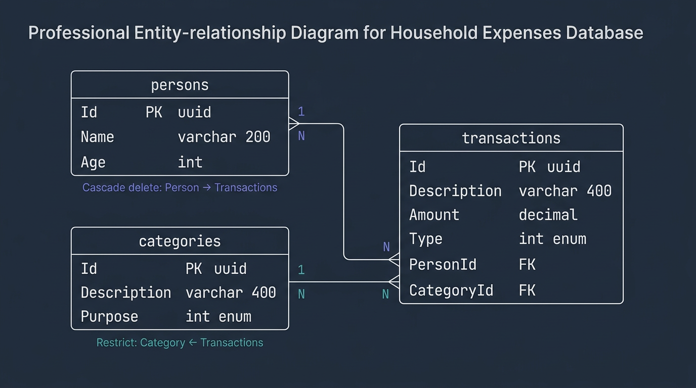

# Household Expenses

**Sistema de controle de gastos residenciais**

[](https://dotnet.microsoft.com/)
[](https://react.dev/)
[](https://www.typescriptlang.org/)
[](https://www.postgresql.org/)
[](https://docs.docker.com/compose/)

---

## Sobre o projeto

O **Household Expenses** é uma aplicação full stack para cadastrar pessoas, categorias e transações financeiras (receitas e despesas), com visões agregadas por pessoa e por categoria, além de um painel resumo. O backend expõe uma API REST documentada com Swagger.

- **Swagger (API em desenvolvimento local, perfil padrão `dotnet run`):** [http://localhost:5049/swagger](http://localhost:5049/swagger)

> Em ambiente Docker, a API escuta na porta **5000** no host; use [http://localhost:5000/swagger](http://localhost:5000/swagger) nesse caso.

---

## Arquitetura

O backend segue **Clean Architecture** com inspiração em **DDD (Domain-Driven Design)**:

- O **domínio** concentra entidades, enums e invariantes, sem dependências de frameworks ou persistência.
- A **aplicação** orquestra casos de uso e define contratos (repositórios, unidade de trabalho).
- A **infraestrutura** implementa acesso a dados (EF Core, PostgreSQL).
- A **API** é a camada de entrada HTTP (controllers, pipeline, middleware).

### Camadas do backend

| Projeto | Responsabilidade |
|--------|-------------------|
| **HouseholdExpenses.Api** | Controllers, middleware, configuração do pipeline ASP.NET Core |
| **HouseholdExpenses.Application** | Casos de uso, interfaces de repositório, orquestração das regras |
| **HouseholdExpenses.Domain** | Entidades, enums, regras de negócio puras |
| **HouseholdExpenses.Infrastructure** | EF Core, repositórios, acesso ao banco |
| **HouseholdExpenses.Communication** | DTOs de request e response (contratos da API) |
| **HouseholdExpenses.Exception** | Exceções customizadas centralizadas |

### Frontend

**React 19** + **TypeScript** + **Vite** + **Tailwind CSS**, consumindo a API via **Axios**.

---

## Diagrama ER

Modelo relacional das entidades persistidas no PostgreSQL (tabelas `persons`, `categories`, `transactions`).



---

## Protótipo de Baixa Fidelidade

O projeto possui uma prototipação de baixa fidelidade disponível no Figma:

[Figma - Household Expenses](https://www.figma.com/design/CGVCW5jN3nr8OEVBpdVcDV/Baixa-Fidelidade-HouseholdExpenses?node-id=0-1&t=L9PSqWHM6Q0V3LPI-1)

---

## Funcionalidades

- **Pessoas:** CRUD completo (criar, listar, editar, excluir).
- **Categorias:** criar e listar.
- **Transações:** criar e listar (com descrição de categoria e nome da pessoa na listagem).
- **Totais por pessoa:** receitas, despesas e saldo por indivíduo, com **saldo geral** consolidado.
- **Totais por categoria:** mesma ideia agregada por categoria, com **totais gerais** no rodapé.
- **Autenticação JWT** — cadastro e login de usuários, todas as rotas da API protegidas com Bearer token

### Regras de negócio destacadas

- **Menor de 18 anos:** só pode registrar transações do tipo **despesa**.
- **Categoria e tipo:** a categoria deve ser **compatível** com o tipo da transação (despesa, receita ou “ambas”).
- **Exclusão em cascata:** ao remover uma pessoa, as transações associadas são removidas conforme configuração do EF Core.

---

## Autenticação

Todas as rotas da API são protegidas por JWT. Para acessar os endpoints é necessário:

1. Criar uma conta em `POST /api/auth/register` com email e senha (mínimo 6 caracteres)
2. Fazer login em `POST /api/auth/login` para obter o token
3. Enviar o token no header `Authorization: Bearer <token>` em todas as requisições

No frontend, o token é armazenado no `localStorage` e enviado automaticamente pelo Axios.

---

## Tecnologias

| Camada | Stack |
|--------|--------|
| **Backend** | .NET 9, EF Core, PostgreSQL, xUnit, Moq, Swagger (OpenAPI) |
| **Frontend** | React 19, TypeScript, Vite, Tailwind CSS, Axios |
| **Infra** | Docker, Docker Compose |

---

## Diferenciais

- **Autenticação JWT** — endpoints protegidos com Bearer token, senhas com hash BCrypt, token com expiração de 8 horas
- **Clean Architecture + DDD** — separação clara de responsabilidades, domínio isolado de infraestrutura
- **Testes unitários** — 25 testes cobrindo regras de negócio do Domain e Use Cases com xUnit e Moq
- **Docker Compose** — ambiente completo com um único comando (`docker compose up -d --build`)
- **Swagger** — documentação interativa da API disponível em `/swagger`
- **Middleware global de exceções** — respostas de erro padronizadas em JSON com status HTTP corretos
- **Protótipo de baixa fidelidade** — wireframes das telas disponíveis no Figma
- **Diagrama ER** — modelo de entidades e relacionamentos do banco de dados
- **Mapeamento manual** — sem AutoMapper, mapeamentos explícitos para total controle
- **AsNoTracking** — queries de leitura otimizadas no EF Core
- **Records para DTOs** — imutabilidade e clareza nos contratos de comunicação

---

## Pré-requisitos

- **Docker** e **Docker Compose**
- **.NET 9 SDK** (execução local da API sem Docker)
- **Node.js 20+** (execução local do frontend)

---

## Como rodar com Docker

```bash
git clone <url-do-repositorio>
cd HouseholdExpenses

# Copiar variáveis de ambiente
cp .env.example .env

# Subir todos os containers
docker compose up -d --build
```

| Serviço | URL |
|---------|-----|
| API | [http://localhost:5000](http://localhost:5000) |
| Swagger | [http://localhost:5000/swagger](http://localhost:5000/swagger) |
| Frontend | [http://localhost:3000](http://localhost:3000) |

O ficheiro `.env.example` documenta variáveis úteis (PostgreSQL, connection string, `VITE_API_URL` para o build do frontend).

---

## Como rodar localmente (sem Docker)

### Backend

Na **raiz** do repositório, suba apenas o PostgreSQL; em seguida execute a API:

```bash
# Na raiz: HouseholdExpenses/
docker compose up household-db -d

cd backend/HouseholdExpenses.Api
dotnet run
```

- API e Swagger (conforme `launchSettings.json`): [http://localhost:5049/swagger](http://localhost:5049/swagger)
- Ajuste a connection string em `appsettings.Development.json` se necessário (host `localhost`, porta **5433** quando usa o contentor da raiz).

### Frontend

```bash
cd frontend/household-expenses-web
npm install
npm run dev
```

O Vite costuma servir em [http://localhost:5173](http://localhost:5173). Configure `VITE_API_URL` (por exemplo em `.env`) apontando para a API (`http://localhost:5049` ou `http://localhost:5000`, conforme o cenário).

---

## Testes

```bash
cd backend
dotnet test
```

Há **25 testes unitários** cobrindo o **Domain** e os **casos de uso** principais (validações, regras de negócio e integração com repositórios mockados via **Moq**).

---

## Estrutura do projeto

```
HouseholdExpenses/
├── backend/
│   ├── HouseholdExpenses.Api/
│   ├── HouseholdExpenses.Application/
│   ├── HouseholdExpenses.Domain/
│   ├── HouseholdExpenses.Infrastructure/
│   ├── HouseholdExpenses.Communication/
│   ├── HouseholdExpenses.Exception/
│   └── HouseholdExpenses.Tests/
├── docs/
│   └── er-diagram.png
├── frontend/
│   └── household-expenses-web/
├── docker-compose.yml
├── .env.example
└── README.md
```

---

## Decisões técnicas

- **Clean Architecture:** separação clara de responsabilidades; o domínio permanece isolado da infraestrutura e de detalhes de entrega (HTTP, banco).
- **Mapeamento manual:** sem AutoMapper, para controle explícito sobre conversões entre entidades e DTOs.
- **Records para DTOs:** imutabilidade e contratos de comunicação legíveis na camada **Communication**.
- **Cascade delete:** configurado via Fluent API do EF Core — ao eliminar uma pessoa, as transações ligadas são removidas de forma consistente.
- **Middleware global de exceções:** tratamento centralizado com respostas JSON padronizadas (por exemplo, lista `errors`).
- **AsNoTracking:** em consultas somente leitura, reduzindo custo de rastreamento no EF Core.

---

## Licença

MIT License
